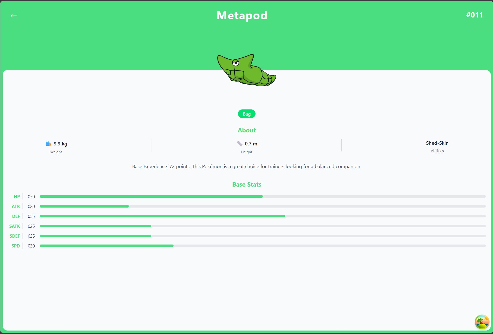
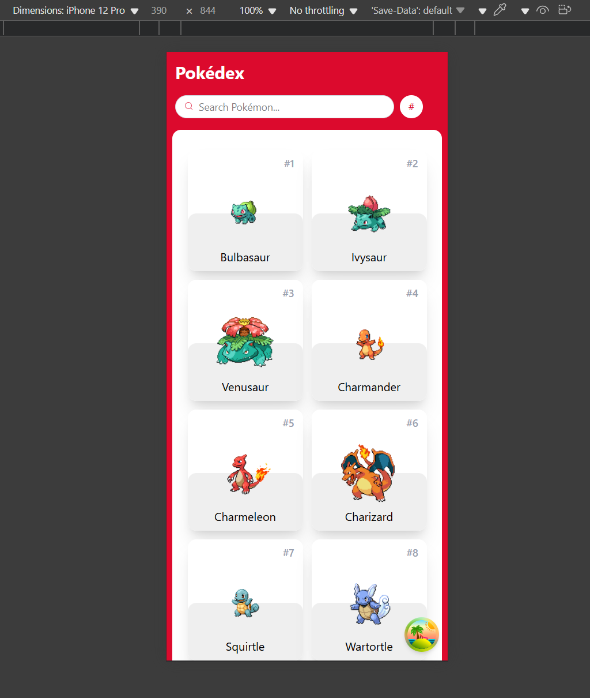
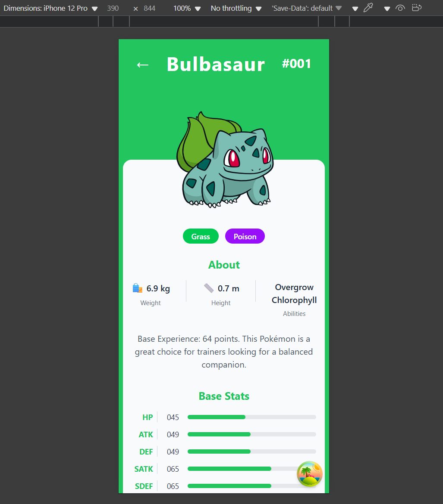

# Pokémon GraphQL App 🚀

Una aplicación web moderna de Pokémon construida con **React**, **TypeScript**, **GraphQL** y **Tailwind CSS**. Explora la Pokédex completa con información detallada, estadísticas reales y un diseño responsive inspirado en las aplicaciones móviles oficiales de Pokémon.

## ✨ Características

- 🔍 **Búsqueda en tiempo real** con debounce para un rendimiento óptimo
- 📊 **Estadísticas base reales** de cada Pokémon (HP, ATK, DEF, SATK, SDEF, SPD)
- 🎨 **Colores dinámicos** basados en el tipo principal del Pokémon
- 📱 **Diseño responsive** que se adapta a dispositivos móviles y desktop
- ⚡ **Navegación fluida** con React Router
- 🔄 **Ordenamiento** por número o nombre alfabético
- 🎯 **Interfaz intuitiva** con componentes reutilizables
- 📈 **Cache inteligente** con React Query para mejor rendimiento

## 🛠️ Tecnologías

- **Frontend**: React 19.1.1 + TypeScript
- **Styling**: Tailwind CSS 4.1.16
- **GraphQL**: GraphQL-Request para consultas a la API
- **State Management**: TanStack React Query 5.90.5
- **Routing**: React Router DOM 7.9.4
- **Build Tool**: Vite 7.1.7
- **API**: PokéAPI v2 con GraphQL

## 🏗️ Arquitectura del Proyecto

```
src/
├── api/                    # Configuración de clientes GraphQL
│   └── graphqlClient.ts
├── components/             # Componentes reutilizables
│   ├── Loading.tsx
│   ├── PokemonCard.tsx
│   ├── SearchInput.tsx
│   ├── SortMenu.tsx
│   └── StatBar.tsx
├── consts/                 # Constantes y configuraciones
│   └── colors.ts
├── hooks/                  # Custom hooks para lógica de datos
│   ├── usePokemon.ts
│   ├── usePokemonAscByName.ts
│   ├── usePokemonAscByNumber.ts
│   └── usePokemonDetail.ts
├── pages/                  # Páginas principales
│   ├── Pokemon.tsx
│   └── PokemonDetail.tsx
├── services/               # Queries GraphQL
│   └── pokemonServices.ts
├── types/                  # Definiciones TypeScript
│   └── pokemon.ts
├── App.tsx                # Componente principal con routing
└── main.tsx               # Punto de entrada
```

## 🚀 Instalación y Uso

### Prerrequisitos

- Node.js (versión 18 o superior)
- npm 

### Instalación

1. **Clona el repositorio**
   ```bash
   git clone <tu-repositorio>
   cd practica-graphql
   ```

2. **Instala las dependencias**
   ```bash
   npm install
   ```

3. **Ejecuta en modo desarrollo**
   ```bash
   npm run dev
   ```

4. **Abre en tu navegador**
   ```
   http://localhost:5173
   ```

### Scripts Disponibles

```bash
npm run dev      # Servidor de desarrollo
npm run build    # Build de producción
npm run preview  # Preview del build
npm run lint     # Análisis de código
```

## 📋 Funcionalidades Detalladas

### 🏠 Página Principal (`/`)
- **Grid responsive** de tarjetas de Pokémon
- **Búsqueda en tiempo real** con debounce de 300ms
- **Ordenamiento** por número ID o nombre alfabético
- **Navegación** a detalle al hacer clic en cualquier tarjeta
- **Paginación** automática con scroll infinito

### 🔍 Página de Detalle (`/pokemon/:name`)
- **Header dinámico** con color del tipo principal
- **Imagen flotante** con posicionamiento absoluto
- **Información completa**: altura, peso, experiencia base, habilidades
- **Estadísticas visuales** con barras de progreso proporcionales
- **Botón de regreso** con navegación fluida

### 🧩 Componentes Reutilizables

#### `PokemonCard`
```tsx
interface PokemonCardProps {
  pokemon: Pokemon;
}
```
- Tarjeta clickeable con imagen y nombre
- Hover effects con Tailwind CSS
- Navegación automática al detalle

#### `StatBar`
```tsx
interface StatBarProps {
  label: string;
  value: number;
  color: string;
}
```
- Barra de estadística reutilizable
- Cálculo automático de porcentajes
- Formato numérico con padding
- Input con debounce integrado
- Icono de búsqueda incluido
- Styling consistente

## 🔌 API y GraphQL

### Endpoint
```
https://beta.pokeapi.co/graphql/v1beta
```

### Queries Principales

#### Lista de Pokémon
```graphql
query GetPokemons {
  pokemon_v2_pokemon(order_by: { id: asc }) {
    id
    name
    pokemon_v2_pokemonsprites {
      sprites
    }
  }
}
```

#### Detalle de Pokémon
```graphql
query GetPokemonByName($name: String!) {
  pokemon_v2_pokemon(where: { name: { _eq: $name } }) {
    id
    name
    height
    weight
    base_experience
    pokemon_v2_pokemonstats {
      base_stat
      pokemon_v2_stat { name }
    }
    pokemon_v2_pokemontypes {
      pokemon_v2_type { name }
    }
    pokemon_v2_pokemonabilities {
      pokemon_v2_ability { name }
    }
    pokemon_v2_pokemonsprites {
      sprites
    }
  }
}
```

## 🎨 Sistema de Colores

Los colores se asignan dinámicamente basados en el tipo principal del Pokémon:

```typescript
const typeColors = {
  fire: 'bg-red-500',
  water: 'bg-blue-500',
  grass: 'bg-green-500',
  electric: 'bg-yellow-400',
  psychic: 'bg-pink-500',
  ice: 'bg-blue-200',
  dragon: 'bg-purple-600',
  dark: 'bg-gray-800',
  fairy: 'bg-pink-300',
  fighting: 'bg-red-700',
  poison: 'bg-purple-500',
  ground: 'bg-yellow-600',
  flying: 'bg-indigo-400',
  bug: 'bg-green-400',
  rock: 'bg-yellow-800',
  ghost: 'bg-purple-700',
  steel: 'bg-gray-400',
  normal: 'bg-gray-400'
};
```

## 📱 Responsive Design

- **Mobile First**: Diseño optimizado para móviles
- **Breakpoints**: 
  - `sm`: 640px - 2 columnas
  - `md`: 768px - 3 columnas  
  - `lg`: 1024px - 4 columnas
  - `xl`: 1280px - 5 columnas

## ⚡ Optimizaciones de Rendimiento

1. **React Query**: Cache automático de consultas GraphQL
2. **Debounced Search**: Reduce llamadas API durante la búsqueda
3. **Code Splitting**: Carga lazy de componentes con React Router
4. **TypeScript**: Detección de errores en tiempo de desarrollo
5. **Vite**: Build ultra-rápido y HMR instantáneo

## 🧪 Estructura de Datos

### Interfaces TypeScript

```typescript
interface Pokemon {
  id: number;
  name: string;
  img: string;
}

interface PokemonDetail extends Pokemon {
  height: number;
  weight: number;
  base_experience: number;
  types: string[];
  abilities: string[];
  stats: {
    hp: number;
    attack: number;
    defense: number;
    special_attack: number;
    special_defense: number;
    speed: number;
  };
}
```




